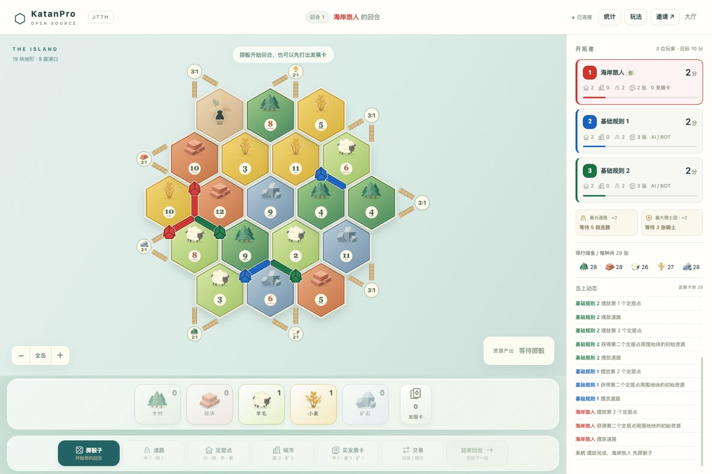
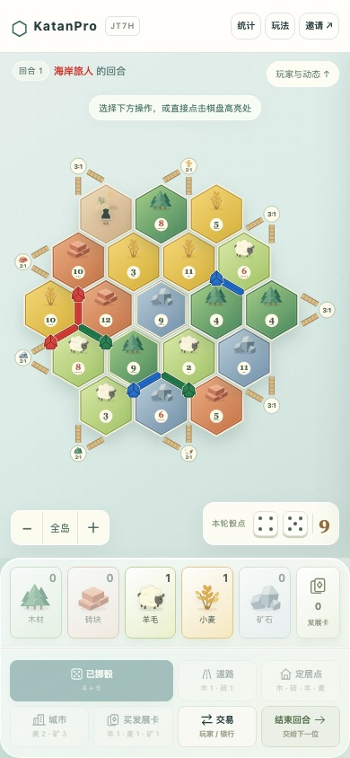
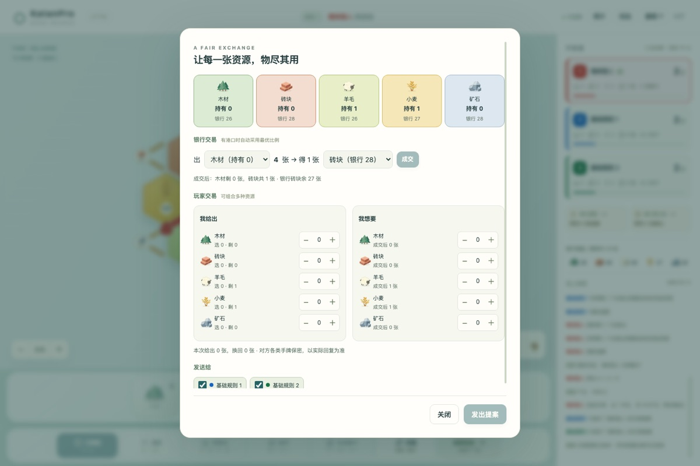
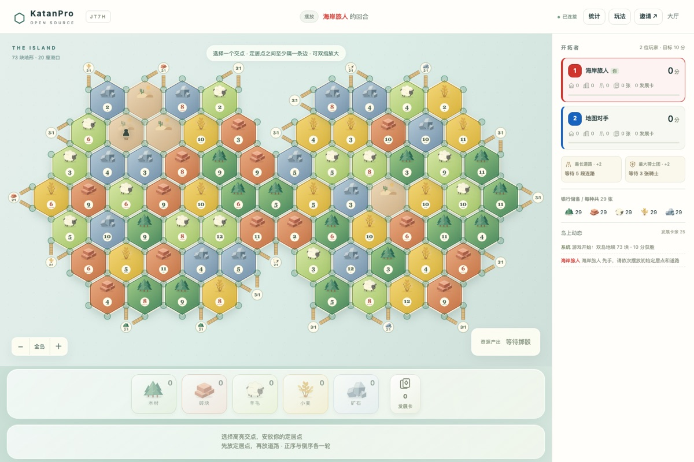

<div align="center">

# KatanPro

**开源的浏览器联机经营棋游戏 —— 开拓、交易、建造，与朋友（或 AI）一起争夺岛屿霸权。**

[](https://github.com/xhd0728/KatanPro/actions/workflows/ci.yml)
[](LICENSE)
[](https://nodejs.org)
[](package.json)

[快速开始](#快速开始) · [配置](#配置) · [玩法](#玩法) · [AI Bot](#ai-bot) · [参与贡献](#参与贡献) · [安全](#安全)



</div>

---

KatanPro 是一个零构建、单依赖的联机经营棋游戏，包含服务端与浏览器前端。掷骰产出资源，交易与谈判换取所需，把定居点升级为城市；率先达到目标分数者获胜。支持 2–8 人房间、可加入对局的机器人、大模型驱动的 AI 对手，以及从 19 格到 73 格的多种地图。

<table>
  <tr>
    <td align="center" valign="top"><br><sub>手机竖屏</sub></td>
    <td align="center" valign="top"><br><sub>多资源交易</sub></td>
    <td align="center" valign="top"><br><sub>73 格双岛地峡</sub></td>
  </tr>
</table>

## 特性

- **实时联机**：基于 WebSocket，2–8 名玩家同房间对局；支持密码房、观战席与断线恢复
- **断线托管**：进行中的玩家断线超过 15 秒后由规则 Bot 临时接管，玩家重连后恢复人工控制
- **AI 对手**：内置不调用外部模型的「规则 Bot」；配置任意 OpenAI 兼容接口后，可启用「大模型 Bot」，失败自动回退到规则 Bot
- **AI 观战模式**：2–8 位 AI 自动对战，人类全部以观战者身份观看，不占席位
- **多种地图**：小（19 格／9 港）、中（30 格／11 港）、大（37 格／12 港），另有 61 格超大大陆与 73 格双岛地峡两种自定义超大地图
- **完整基础规则**：正倒序初始摆放、7 点强盗与抢牌、多资源双向交易、港口 3:1／2:1、发展卡、最长路
- **移动端友好**：双指缩放、拖动、点选建造两段式确认，竖屏／横屏自适应
- **工程健全**：规则引擎服务端权威、加密随机；单元测试 + 完整对局模拟 + 无头浏览器回归，全部在 CI 中运行
- **极简技术栈**：Node.js 原生实现，运行时仅依赖 [`ws`](https://www.npmjs.com/package/ws)，无框架、无构建步骤

> **当前限制**：房间与对局只保存在内存中，服务重启会清空进行中的游戏；5–8 人模式使用普通轮流回合，未实现实体扩展的特殊建造阶段；界面目前仅提供中文。

## 快速开始

### 环境要求

- Node.js >= 22（需要 `node --test` 与 `loadEnvFile` 支持）

### 运行

```bash
git clone https://github.com/xhd0728/KatanPro.git
cd KatanPro
npm ci
npm start
```

打开 <http://localhost:8787>，输入昵称并创建房间即可。邀请其他玩家访问同一地址加入；可在房间中随时添加机器人。

> 可选：`cp .env.example .env` 并填写 AI 配置以启用大模型 Bot（见[配置](#配置)）。不配置也完全可以游戏。

### 生产部署

支持 `HOST`／`PORT` 环境变量，例如：

```bash
HOST=0.0.0.0 PORT=52001 npm start
```

文件传输、systemd 常驻运行、防火墙放行与单文件部署步骤见 [DEPLOY.md](DEPLOY.md)。

> 注意：房间与对局状态保存在内存中，重启服务会清空进行中的游戏。对公网开放时建议在前面加一层 HTTPS 反向代理（如 Nginx、Caddy）：房间密码通过 WebSocket 连接地址传输，页面在 HTTPS 下会自动改用 `wss://`。

### 单文件可执行程序

无需在目标机器安装 Node.js。项目内置基于 Node.js [Single Executable Application](https://nodejs.org/api/single-executable-applications.html) 的打包脚本，把 Node 运行时、服务端代码与前端资源打成**一个可执行文件**：

```bash
npm run build
# 产物：dist/katanpro-<platform>-<arch>，例如 dist/katanpro-darwin-arm64
```

把产物拷贝到目标机器，`chmod +x` 后直接运行：

```bash
./katanpro-linux-x64
# 等价于 npm start，同样读取 HOST / PORT 与同目录下的 .env
```

要点：

- 前端资源（`public/`）已内嵌进二进制；若可执行文件旁存在 `public/` 目录，磁盘文件优先，便于免重新打包覆盖前端
- `.env` 从可执行文件所在目录读取，与源码运行行为一致
- 产物**与构建机的操作系统和 CPU 架构绑定**（Linux x64、macOS arm64 等需分别在对应环境构建，或用 CI 矩阵交叉产出）
- 产物约 100 MB（含完整 Node 运行时）；追求更小体积可改用容器镜像方案

## 配置

所有配置通过环境变量提供；服务端启动时还会读取项目根目录（单文件模式下为可执行文件所在目录）的 `.env`，已设置的环境变量优先。`.env` 已列入 `.gitignore`，请勿提交真实密钥。浏览器端不需要任何配置，模型密钥只在服务端使用、不会发送给玩家。

| 变量 | 说明 | 默认值 |
|---|---|---|
| `HOST` | 监听地址 | `0.0.0.0` |
| `PORT` | 监听端口 | `8787` |
| `CATAN_AI_BASE_URL` | OpenAI 兼容接口地址 | 空（禁用大模型 Bot） |
| `CATAN_AI_MODEL` | 模型名称 | 空 |
| `CATAN_AI_KEY` | 接口密钥 | 空 |
| `CATAN_AI_TIMEOUT_MS` | 模型请求超时（毫秒） | `9000` |
| `CATAN_DISCONNECT_TAKEOVER_MS` | 断线后交给规则 Bot 临时接管的等待时间（毫秒） | `15000` |
| `CATAN_UNCLAIMED_ROOM_MS` | 新建后无人加入的房间保留时间（毫秒） | `60000` |
| `CATAN_MAX_ROOMS` | 服务器同时存在的房间数上限 | `500` |

## 玩法

默认规则：19 格小地图、10 分获胜。开局前房主可在房间内调整地图、胜利分数（7／10／12／15）、开局赠送资源、房间密码与机器人数量／难度。

- **初始摆放**：正序、倒序各摆一个定居点和一条道路；第二个定居点领取相邻资源
- **产出与强盗**：掷骰后对应地块产出资源；掷出 7 点触发弃牌、移动强盗与抢牌（日志不公开被抢资源种类）
- **交易**：可与任意玩家发起多资源交换，或与银行／港口按 4:1、3:1、2:1 兑换；银行每种资源 29 张
- **建造上限**：每人 15 条道路、5 个定居点、4 座城市
- **发展卡**：每回合至多打出一张，当回合新购的卡不能立即打出；胜利点卡自动计分
- **获胜**：只在自己的回合达到目标分数时获胜；最长路并列时由原持有者保留

完整规则可在游戏页面右上角「玩法」中查看，或参考 [CATAN 官方规则](https://www.catan.com/understand-catan/game-rules)。

### 地图一览

| 地图 | 地块 | 港口 | 建议人数 |
|---|---|---|---|
| 小地图 | 19 | 9 | 2–4 |
| 中地图 | 30 | 11 | 3–6 |
| 大地图 | 37 | 12 | 4–8 |
| 超大大陆 | 61 | 18 | 6–8 |
| 双岛地峡 | 73 | 20 | 6–8 |

港位固定，资源地形、数字与港口类型随机；双岛地图由中央陆地通道连接，可沿常规规则修路。

## AI Bot

AI 难度分为「低／中／高／极高／最高」，默认「中」。低档是纯本地规则；中档调用一次轻量大模型；高档调用一次标准大模型；极高档提供更多候选位置和路线信息；最高档在首次决策后再调用一次模型复核。模型不可用、超时或返回非法动作时，所有档位都会回退到规则策略。策略目录由服务端 `/api/bot-profiles` 提供，公开目录只返回标识、名称和说明。旧配置中的 `rule` 和 `llm` 仍分别兼容映射到「低」和「中」。

扩展新策略：在 `bots/profiles.js` 中注册一个实现 `decide({ state, config, fallback, onFallback })` 的对象即可。`state` 只包含该 AI 有权查看的信息，`config` 仅在服务端使用；返回动作或动作 Promise。

健壮性设计：

- 模型超时、请求失败或返回非法动作时，规则 Bot 立即接手，原因写入游戏日志
- AI 主动发起的交易 30 秒未获回复则自动撤回；延迟返回的模型结果不会用于已更换的提案
- 测试使用本地模拟模型服务，不需要真实 API Key

## 测试

```bash
npm test        # 单元测试 + 完整对局模拟
npm run test:ui # 无头浏览器回归
```

- **单元与网络测试**：双人联机与 AI 回退、密码与观战权限、刷新恢复席位、资源短缺、抢牌隐私、发展卡、最长路并列、胜利时机、多人交易
- **对局模拟**：2／3／4／6／8 人完整对局，逐步检查资源守恒与建筑上限，覆盖 AI 等待人类弃牌等调度场景
- **浏览器回归**：自动启动独立测试服务与无头 Chrome，覆盖三人开局、棋盘点击、报价响应、页面刷新、移动端触摸手势与 320–1440 像素宽度；截图保存在 `artifacts/ui/`。macOS 自动寻找 Chrome，其他环境可设置 `CHROME_BIN`

## 项目结构

```
.
├── server.js             # HTTP / WebSocket 服务与房间管理
├── game/
│   ├── engine.js         # 规则引擎（服务端权威，加密随机）
│   ├── map-layouts.js    # 地图布局定义
│   └── bot-scheduling.js # 机器人调度器
├── bots/profiles.js      # AI 策略注册表
├── bot.js                # 规则 Bot 与大模型 Bot 实现
├── config.js             # 环境变量加载
├── public/               # 前端（原生 JavaScript，无构建步骤）
├── scripts/build-sea.mjs # 单文件可执行程序打包脚本
├── docs/images/          # README 截图
└── test/                 # 单元 / 网络 / 模拟 / 浏览器测试
```

## 参与贡献

欢迎 Issue 和 Pull Request！

- **报告问题**：请提交 [Issue](https://github.com/xhd0728/KatanPro/issues)，附上复现步骤、期望行为与实际行为；UI 问题欢迎附截图
- **提交 PR**：
  1. Fork 本仓库并创建分支
  2. 本地通过 `npm test` 与 `npm run test:ui`（CI 会运行同样的检查）
  3. 新功能建议先开 Issue 讨论，或在 PR 中说明动机与替代方案
  4. 保持提交聚焦，PR 描述中关联相关 Issue
- **好上手**：欢迎从标注 `good first issue` 的任务开始（如补充测试、翻译文档、美术打磨）
- **提交信息**：遵循 [Conventional Commits](https://www.conventionalcommits.org/)，格式为 `type(scope): 小写描述`，例如 `fix(server): reject static paths containing NUL bytes`

所有贡献默认以 AGPL-3.0 许可证授予，与本项目保持一致。

## 安全

请**不要**通过公开 Issue 报告安全漏洞。请使用 GitHub 的 [私密漏洞报告](https://github.com/xhd0728/KatanPro/security/advisories/new) 提交，并附上影响范围与复现步骤；我们会在修复发布后公开致谢。

## 许可

本项目以 [GNU AGPL v3](LICENSE)（`AGPL-3.0-only`）授权。依据 AGPL 第 13 条：若你修改本项目的代码并部署为网络服务，即使不分发副本，也必须向该服务的用户提供修改后的完整源代码。运行时依赖 `ws` 采用 MIT 许可证，与 AGPL 兼容。

> **免责声明**：KatanPro 是个人发起的开源游戏项目，为桌面游戏《卡坦岛》玩法的原创实现，与 CATAN、Catan GmbH 或 KOSMOS 无任何关联，也未获得其认可或授权。CATAN 为 Catan GmbH 的注册商标。游戏规则本身不受版权保护；本项目的所有代码与 `public/assets/` 下的 SVG 插画均为原创。
